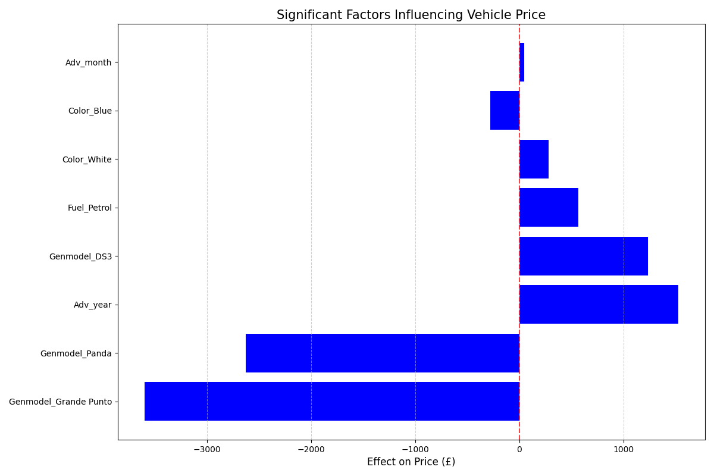

# 🚗 Prediction Vehicle Advertisement Price

This project aims to predict the **advertised price of vehicles** based on various features like model, year, color, fuel type, and advertisement timing. Using regression models, we identify and quantify the impact of each factor on the price.

---

## 📊 Overview

We analyzed a dataset of car advertisements and used regression techniques to understand how specific factors influence vehicle prices. Below is a visual representation of the most significant factors affecting vehicle advertisement price.



---

## 🔍 Key Insights

- **Vehicle Model** has a major impact on price, with some models decreasing the price by over £3000.
- **Advertisement Year** contributes positively to the price — newer listings tend to be priced higher.
- **Fuel Type** and **Color** also show notable influence.

---

## 📁 Files

- `cleaned_car_data.csv` — Cleaned dataset used for modeling.
- `significant_price_factors.png` — Visualization of regression coefficients.
- `modeling.ipynb` *(optional)* — Jupyter notebook with training and evaluation.
- `vehicle_price_model.pkl` *(optional)* — Serialized machine learning model.

---

## 🧠 Model Used

- **Linear Regression** — used to estimate the relationship between vehicle features and price.
- *(Optionally include others if used: Random Forest, XGBoost, etc.)*

---

## ⚙️ How to Run

1. Clone the repo:
   ```bash
   git clone git@github.com:MadhavSapkota/Prediction-Vehicle-Advertisement-Price.git
   cd Prediction-Vehicle-Advertisement-Price
   ```


2. Run the notebook or script to train and visualize.

---

## 📌 Future Improvements

- Add more models and compare performance
- Deploy as a web app with Streamlit or Flask
- Use real-time data for live predictions

---

## 📄 License

This project is licensed under the MIT License.

---

Let me know if you want me to generate this as a markdown file or if you'd like to include performance metrics, too!
